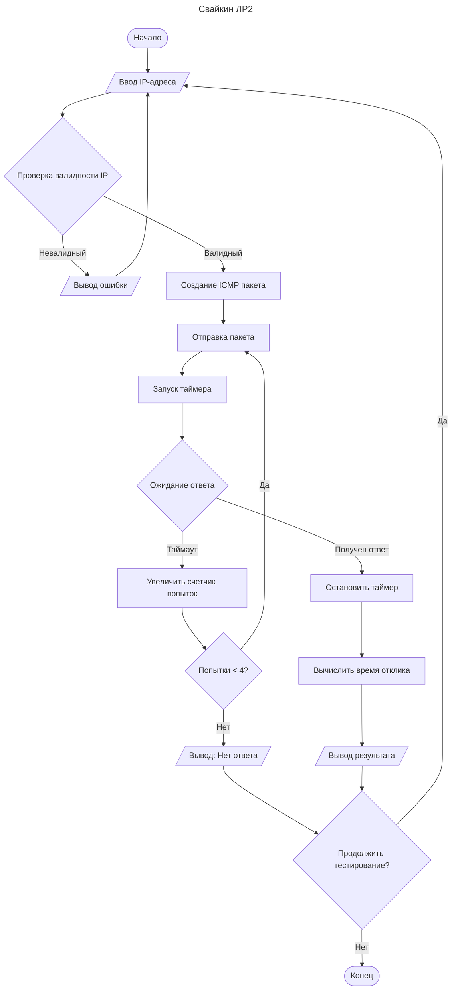
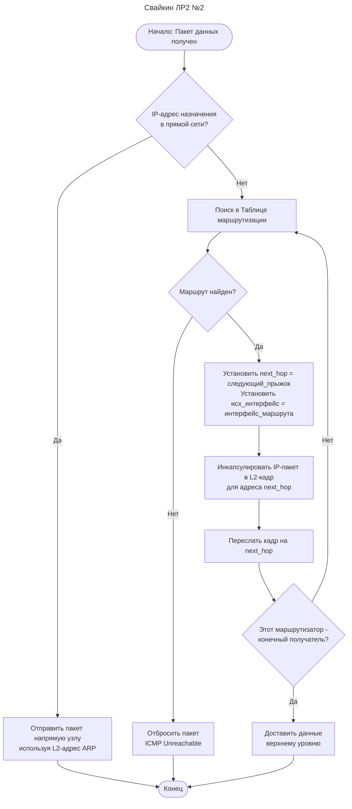
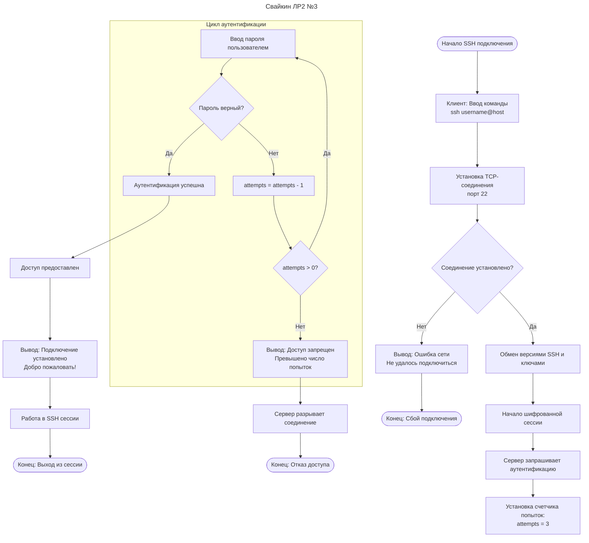
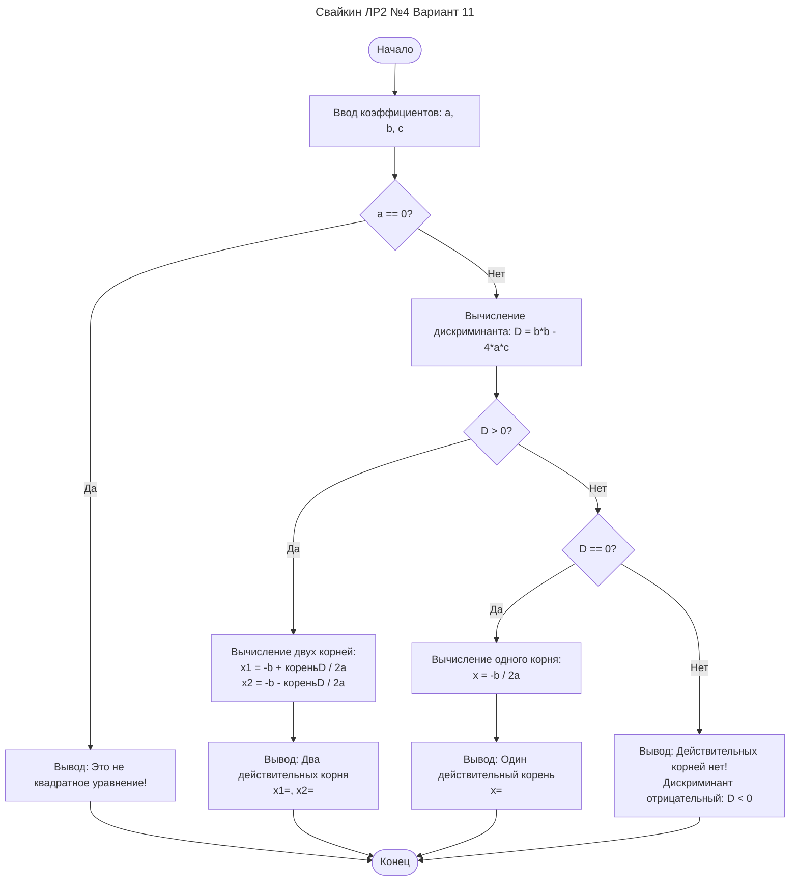

```mermaid
---
title: Свайкин ЛР2 #1
---
flowchart TD
    A([Начало]) --> B[/Ввод IP-адреса/]
    B --> C{Проверка валидности IP}
    C -->|Невалидный| D[/Вывод ошибки/]
    D --> B
    C -->|Валидный| E[Создание ICMP пакета]
    E --> F[Отправка пакета]
    F --> G[Запуск таймера]
    G --> H{Ожидание ответа}
    H -->|Таймаут| I[Увеличить счетчик попыток]
    I --> J{Попытки < 4?}
    J -->|Да| F
    J -->|Нет| K[/Вывод: Нет ответа/]
    H -->|Получен ответ| L[Остановить таймер]
    L --> M[Вычислить время отклика]
    M --> N[/Вывод результата/]
    K --> O
    N --> O{Продолжить тестирование?}
    O -->|Да| B
    O -->|Нет| P([Конец])
```

```mermaid
---
title: Свайкин ЛР2 №2
---
flowchart TD
    A([Начало: Пакет данных получен]) --> B{IP-адрес назначения<br>в прямой сети?}
    B -- Да --> C[Отправить пакет напрямую узлу<br>используя L2-адрес ARP]
    B -- Нет --> D[Поиск в Таблице маршрутизации]
    D --> E{Маршрут найден?}
    E -- Нет --> F[Отбросить пакет<br>ICMP Unreachable]
    E -- Да --> G[Установить next_hop = следующий_прыжок<br>Установить исх_интерфейс = интерфейс_маршрута]
    G --> H[Инкапсулировать IP-пакет в L2-кадр<br>для адреса next_hop]
    H --> I[Переслать кадр на next_hop]
    I --> J{Этот маршрутизатор -<br>конечный получатель?}
    J -- Нет --> D
    J -- Да --> K[Доставить данные<br>верхнему уровню]
    F --> L
    C --> L
    K --> L([Конец])
```

```mermaid
---
title: Свайкин ЛР2 №3
---
flowchart TD
A([Начало SSH подключения]) --> B[Клиент: Ввод команды<br>ssh username@host]
B --> C[Установка TCP-соединения<br>порт 22]
C --> D{Соединение установлено?}
D -- Нет --> E[Вывод: Ошибка сети<br>Не удалось подключиться]
E --> F([Конец: Сбой подключения])
D -- Да --> G[Обмен версиями SSH и ключами]
G --> H[Начало шифрованной сессии]
H --> I[Сервер запрашивает аутентификацию]
I --> J[Установка счетчика попыток:<br>attempts = 3]
subgraph Цикл аутентификации
K[Ввод пароля пользователем] --> L{Пароль верный?}
L -- Да --> M[Аутентификация успешна]
L -- Нет --> N[attempts = attempts - 1]
N --> O{attempts > 0?}
O -- Да --> K
O -- Нет --> P[Вывод: Доступ запрещен<br>Превышено число попыток]
end
P --> Q[Сервер разрывает соединение]
Q --> R([Конец: Отказ доступа])
M --> S[Доступ предоставлен]
S --> T[Вывод: Подключение установлено<br>Добро пожаловать!]
T --> U[Работа в SSH сессии]
U --> V([Конец: Выход из сессии])
```

```mermaid
---
title: Свайкин ЛР2 №4 Вариант 11
---
flowchart TD
    A([Начало]) --> B[Ввод коэффициентов: a, b, c]
    B --> C{a == 0?}
    C -- Да --> D[Вывод: Это не квадратное уравнение!]
    D --> E([Конец])
    C -- Нет --> F[Вычисление дискриминанта: D = b*b - 4*a*c]
    F --> G{D > 0?}
    G -- Да --> H[Вычисление двух корней:<br>x1 = -b + кореньD / 2a<br>x2 = -b - кореньD / 2a]
    H --> I[Вывод: Два действительных корня<br>x1=, x2=]
    I --> E
    G -- Нет --> J{D == 0?}
    J -- Да --> K[Вычисление одного корня:<br>x = -b / 2a]
    K --> L[Вывод: Один действительный корень<br>x=]
    L --> E
    J -- Нет --> M[Вывод: Действительных корней нет!<br>Дискриминант отрицательный: D < 0]
    M --> E
```