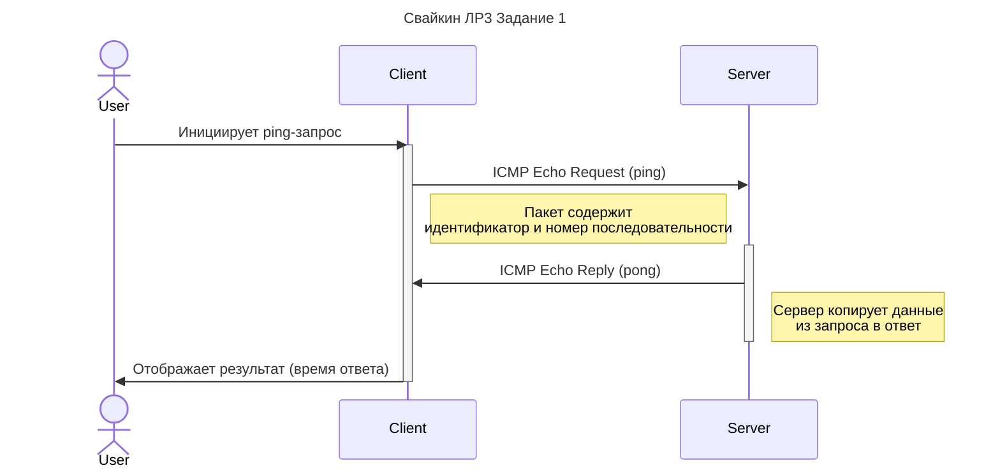
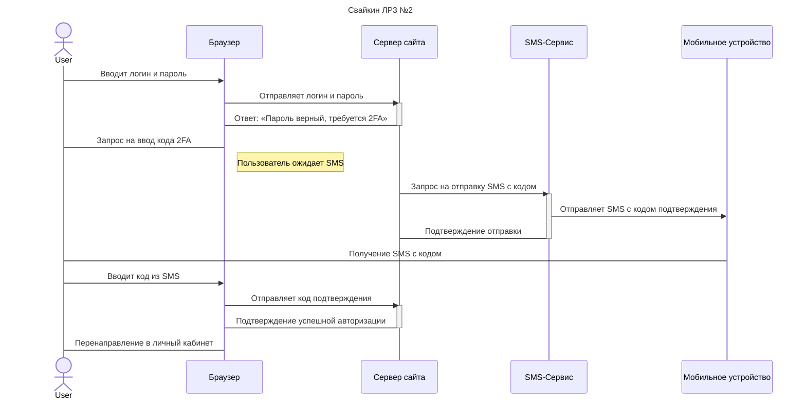
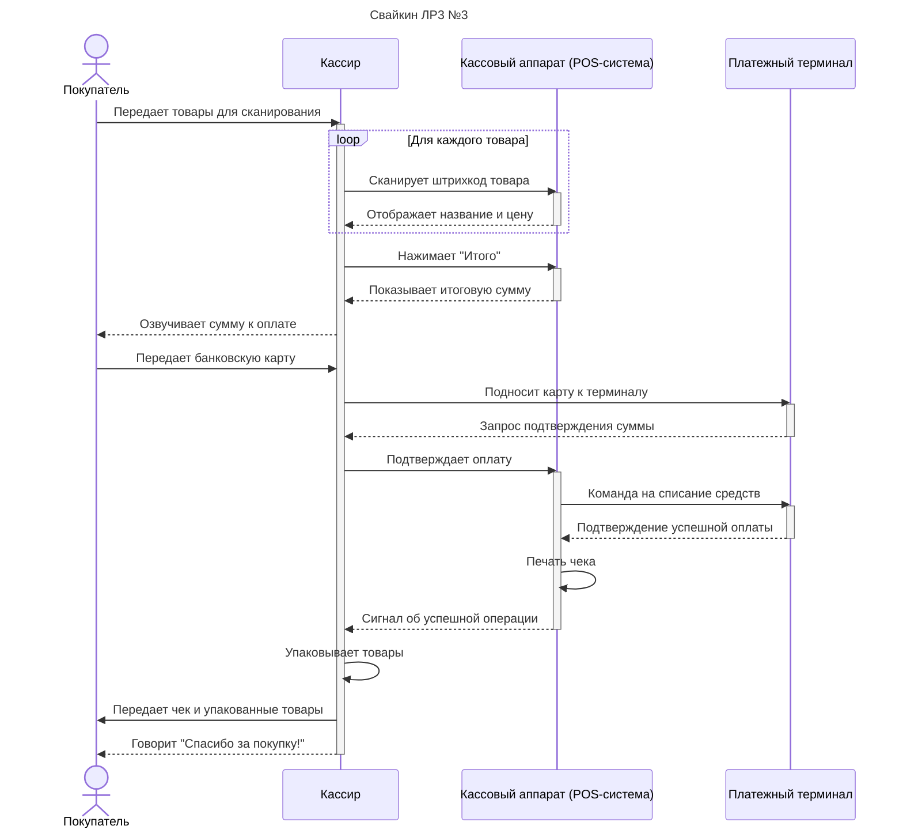
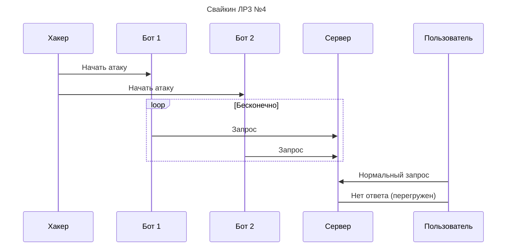

```mermaid
---
title: Свайкин ЛР3 Задание 1
---
sequenceDiagram

    actor User

    participant Client

    participant Server

   User->>Client: Инициирует ping-запрос

    Activate Client

        Client->>Server: ICMP Echo Request (ping)

Note right of Client: Пакет содержит<br>идентификатор и номер последовательности

Activate Server

Server->>Client: ICMP Echo Reply (pong)

    Note right of Server: Сервер копирует данные<br>из запроса в ответ

    Deactivate Server

Client->>User: Отображает результат (время ответа)

    Deactivate Client
```

```mermaid
---
title: Свайкин ЛР3 №2
---
sequenceDiagram

    actor User as User

    participant Browser as Браузер

    participant Server as Сервер сайта

    participant SMSService as SMS-Сервис

    participant Mobile as Мобильное устройство

    User->>Browser: Вводит логин и пароль

    Browser->>Server: Отправляет логин и пароль

    Activate Server

    Server->Browser: Ответ: «Пароль верный, требуется 2FA»

    Deactivate Server

    Browser->User: Запрос на ввод кода 2FA

    Note right of Browser: Пользователь ожидает SMS

    Server->>SMSService: Запрос на отправку SMS с кодом

    Activate SMSService

    SMSService->>Mobile: Отправляет SMS с кодом подтверждения

    SMSService->Server: Подтверждение отправки

    Deactivate SMSService

    Mobile->User: Получение SMS с кодом

    User->>Browser: Вводит код из SMS

    Browser->>Server: Отправляет код подтверждения

    Activate Server

    Server->Browser: Подтверждение успешной авторизации

    Deactivate Server

    Browser->User: Перенаправление в личный кабинет
```

```mermaid
---
title: Свайкин ЛР3 №3
---
sequenceDiagram
    actor Buyer as Покупатель
    participant Cashier as Кассир
    participant POS as Кассовый аппарат (POS-система)
    participant PaymentTerminal as Платежный терминал
    Buyer->>Cashier: Передает товары для сканирования
    activate Cashier
    loop Для каждого товара
        Cashier->>POS: Сканирует штрихкод товара
        activate POS
        POS-->>Cashier: Отображает название и цену
        deactivate POS
    end
    Cashier->>POS: Нажимает "Итого"
    activate POS
    POS-->>Cashier: Показывает итоговую сумму
    deactivate POS
    Cashier-->>Buyer: Озвучивает сумму к оплате
    Buyer->>Cashier: Передает банковскую карту
    Cashier->>PaymentTerminal: Подносит карту к терминалу
    activate PaymentTerminal
    PaymentTerminal-->>Cashier: Запрос подтверждения суммы
    deactivate PaymentTerminal
    Cashier->>POS: Подтверждает оплату
    activate POS
    POS->>PaymentTerminal: Команда на списание средств
    activate PaymentTerminal
    PaymentTerminal-->>POS: Подтверждение успешной оплаты
    deactivate PaymentTerminal
    POS->>POS: Печать чека
    POS-->>Cashier: Сигнал об успешной операции
    deactivate POS
    Cashier->>Cashier: Упаковывает товары
    Cashier->>Buyer: Передает чек и упакованные товары
    Cashier-->>Buyer: Говорит "Спасибо за покупку!"
    deactivate Cashier
```

```mermaid
---
title: Свайкин ЛР3 №4
---
 sequenceDiagram
    participant Hacker as Хакер
    participant Bot1 as Бот 1
    participant Bot2 as Бот 2
    participant Server as Сервер
    participant User as Пользователь
    Hacker->>Bot1: Начать атаку
    Hacker->>Bot2: Начать атаку
    Loop Бесконечно
        Bot1->>Server: Запрос
        Bot2->>Server: Запрос
    End
    User->>Server: Нормальный запрос
    Server->User: Нет ответа (перегружен)

```
```